# Real Estate Revelations: The Power of Predictive Modeling
## Introduction

In the fast-paced world of real estate, every smart upgrade can make or break a sale. Now, imagine if you had a tool that could tell you exactly which home renovations would boost property values the most. 

Picture this: a real estate agent, with the help of advanced data analytics, effortlessly identifying the best improvements for any home, ensuring every dollar spent translates into a significant increase in value. 

Welcome to our real estate valuation project, where we combine the power of modern statistics with the practical needs of home renovation. Using state-of-the-art linear regression models, we uncover the hidden gems in the data, guiding you through the maze of property enhancements to find the most profitable path. 

Join us on this journey to turn guesswork into strategy and potential into profit, making homes not just beautiful places to live, but smart investments for the future.

## Problem Statement
Determining which home renovations will most effectively increase property values is a significant challenge for real estate agencies, homeowners, and property investors. 

Without precise, data-driven guidance, resources are often allocated to improvements that yield suboptimal returns, leading to inefficiencies and missed opportunities for maximizing property values. 

This project aims to address this problem by leveraging advanced linear regression models to identify key features and renovations that significantly impact home values. By providing clear, actionable insights, the project seeks to empower stakeholders to make informed decisions, optimize resource allocation, and ultimately enhance the market value of properties.
## Objectives

### 1. Data cleaning and preparation.

To Obtain a dataset that contains relevant information, clean the data and prepare it for modeling

### 2. Feature Selection and Modelling

To determine the features in the dataset that are most predictive and use them to build linear regression models.

### 3. Model evaluation and validation

To use metrics to evaluate and validate the linear regression model built.

### 4. Provide Recommendations

To use the insights from the data and the models to offer actionable insights.
## Data Understanding
This project uses the King County House Sales dataset, which is available in the file `kc_house_data`.csv. 

The dataset includes comprehensive information on house sales in King County, providing valuable insights into various attributes that influence property values.

This dataset is highly suitable for addressing the problem of identifying key home renovations that increase property values. This is because it has a wide range of features that are crucial in analysing house value.
### Description of columns
The dataset contains 21 columns and 21,597 rows.

Now to go into more detail on the columns we have. We will use the `column_names.md` file to get more information about our columns.
* `id` - Unique identifier for a house
* `date` - Date house was sold
* `price` - Sale price (prediction target)
* `bedrooms` - Number of bedrooms
* `bathrooms` - Number of bathrooms
* `sqft_living` - Square footage of living space in the home
* `sqft_lot` - Square footage of the lot
* `floors` - Number of floors (levels) in house
* `waterfront` - Whether the house is on a waterfront
* `view` - Quality of view from house. An index from 0 to 4 of how good the view of the property was.
* `condition` - How good the overall condition of the house is. Related to maintenance of house. An index from 1 to 5 on the condition of the house.
* `grade` - Overall grade of the house. Related to the construction and design of the house, where 1-3 is poor, 4-6 is low average, 7 is average, 8-9 is good, and 10-13 is excellent.
* `sqft_above` - Square footage of house apart from basement
* `sqft_basement` - Square footage of the basement
* `yr_built` - Year when house was built
* `yr_renovated` - Year when house was renovated
* `zipcode` - ZIP Code used by the United States Postal Service
* `lat` - Latitude coordinate
* `long` - Longitude coordinate
* `sqft_living15` - The square footage of interior housing living space for the nearest 15 neighbors
* `sqft_lot15` - The square footage of the land lots of the nearest 15 neighbors

**Data Preparation and Cleaning**

In this section,we are to clean and prepare our data to make it as consistent and useful as possible by using python's libraries frameworks.
This includes adding needed columns through what we already have, checking and aligning the datatypes of our column,identifying and dropping duplicate values,identifying and solving of null or missing values by prioritisation

**Step 1:**
we check the data type of features in oure data set to get:

<class 'pandas.core.frame.DataFrame'>

RangeIndex: 21597 entries, 0 to 21596

Data columns  (total 21 columns):
# Table

| Column         | Non-Null Count  | Dtype   |
| -------------- | --------------- | ------- |
| id             | 21597 non-null  | int64   |
| date           | 21597 non-null  | object  |
| price          | 21597 non-null  | float64 |
| bedrooms       | 21597 non-null  | int64   |
| bathrooms      | 21597 non-null  | float64 |
| sqft_living    | 21597 non-null  | int64   |
| sqft_lot       | 21597 non-null  | int64   |
| floors         | 21597 non-null  | float64 |
| waterfront     | 19221 non-null  | object  |
| view           | 21534 non-null  | object  |
| condition      | 21597 non-null  | object  |
| grade          | 21597 non-null  | object  |
| sqft_above     | 21597 non-null  | int64   |
| sqft_basement  | 21597 non-null  | object  |
| yr_built       | 21597 non-null  | int64   |
| yr_renovated   | 17755 non-null  | float64 |
| zipcode        | 21597 non-null  | int64   |
| lat            | 21597 non-null  | float64 |
| long           | 21597 non-null  | float64 |
| sqft_living15  | 21597 non-null  | int64   |
| sqft_lot15     | 21597 non-null  | int64   |
dtypes: float64(6), int64(9), object(6)
memory usage: 3.5+ MB

From observations,the following had to tranform to enable consistency in our data

* 'id' - integer ( Should be a string)

* 'date' - object (Should be datetime)

* 'bathrooms' - float64 (Should be integer, as there are no half bathrooms)

* 'floors' - float64 (Should be integer)

* 'condition' - object (Should be integer, An index from 1 to 5 on the condition of the house.)

* 'grade': object (Should be split into the grade number, an integer, and the grade comment, which is a string)

* 'sqft_basement': object (Should be converted to a float)

**Step 2:**
Identifying and solving of null or missing values by prioritisation.

**Missing Values Observations:**

 * waterfront has some missing values (11% of the data)

 * view has a few missing values (0.29% of the data)

 * sqft_basement has a few nissing values (2.1% of the data)

 * yr_renovated has many missing values (17.79% of the data).

 * Srategies for dealing with the missing values:

 * waterfront and waterfront_description (11%):

Since waterfront is a categorical variable, 
  * we can fill the missing values with the most frequent category: 'NO', which is 0
 yr_renovated (17.79%):
  * We can fill the missing values with 0.
     A value of 0 might indicate that the house was never renovated.
sqft_basement (2.1%)
  * we can also fill in with the mode

**Step 3**
Check for duplicate values which in our case we do not have any.

**Step 4**
Next step,we checked for the cardinality for each column and we can tell that we have some entries that have the same ids.we extracte those entries to have a closer look and check if they are duplicates only to find out that they are the same houses, with different selling dates. We can assume that these are houses that have been sold more than once at different times.

So lets sort the date in ascending order and delete the first sale entry and only keep the latest house sale and the results data has 21,420 rows and 23 columns from the earlier 21 columns and 21,597 rows.

**Feature Engineering**

We have already created the new columns, *grade_numeric*, *grade_description*, *condition_description*, *view_description*, and *waterfront_description* to help us with our analysis.

We can consider creating:

age_of_house: age = 2024 - yr_built
renovation_age: renovation_age = 2024 - yr_renovated (if renovated, otherwise 0) and display the first 5 as shown below

| age_of_house | renovation_age |
|--------------|----------------|
| 70           | 0.0            |
| 12           | 0.0            |
| 48           | 0.0            |
| 15           | 0.0            |
| 73           | 0.0            |

**Summary statistics**

Here are some key insights from the summary statistics of the dataset:

**1.Price:**

The average price of the houses is approximately 
367,557.

Prices range from 
7,700,000.

**2.Bedrooms and Bathrooms:**

Most houses have around 3-4 bedrooms, with a minimum of 1 and a maximum of 33.

Bathrooms range from 0 to 8, with an average of around 2.

**3.Square Footage:**

The average living area is about 2,083 square feet, with a range from 370 to 13,540 square feet.

Lot sizes vary significantly, with a mean of 15,128 square feet, ranging from 520 to 1,651,359 square feet.

**4.Floors:**

Houses typically have 1 to 2 floors, with a few exceptions having up to 4 floors.

**5.Waterfront:**

A small percentage of houses are on the waterfront (approximately 0.68%).

**6.View and Condition:**

The majority of houses do not have a notable view (average view score of 0.23 on a scale of 0-4).

The overall condition is generally good, with most houses rated around 3-4 on a scale of 1-5.

**7.Grades:**

Houses are mostly rated between 5-6 in grade, with a few exceptional houses rated as high as 11 (Mansion).

**8.Age and Renovation:**

The average age of the houses is about 53 years, ranging from 9 to 124 years.

Most houses have not been renovated (renovation age of 0), but among those renovated, the renovation age ranges up to 90 years.

**9.Age Distribution:**

Most houses were built in the mid-20th century, with a median build year of 1975.

**10.Latitude and Longitude:**

The houses are distributed across various locations, with latitudes ranging from 47.1559 to 47.7776 and longitudes from -122.5190 to -121.3150.

  **Univarriate Analysis**

First we can have a look at the distribution of our numerical variables
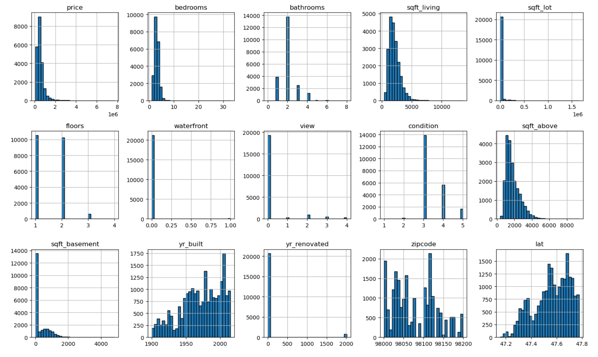
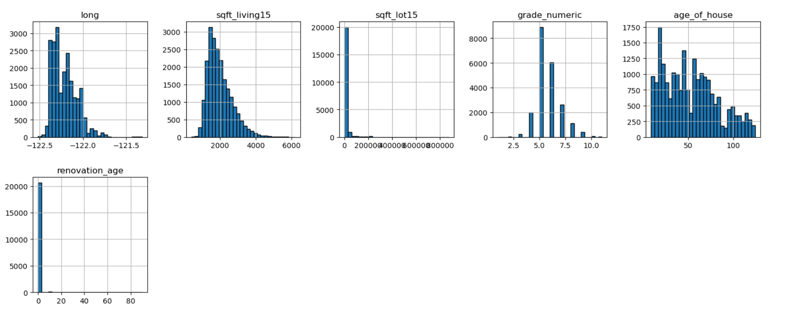

Observations:

1.**Price:**

The distribution is right-skewed, indicating that most houses are priced below $1 million, with a few very high-priced properties.

2.**Bedrooms:**

Most houses have 3 to 4 bedrooms. There are few houses with more than 6 bedrooms, and very few with exceptionally high bedroom counts.

3.**Bathrooms:**

Most houses have between 1 and 3 bathrooms. The distribution shows a right skew with fewer houses having more than 4 bathrooms.

4.**Sqft_Living:**

The distribution is right-skewed, with most houses having less than 4000 sqft of living space.

5.**Sqft Lot:**

The distribution is heavily right-skewed with most houses having lot sizes less than 15,000 sqft. There are a few outliers with very large lot sizes.

6.**Floors:**

Most houses have either 1 or 2 floors, with very few having 3 or more floors.

7.**Waterfront:**

The distribution indicates that a very small number of houses are on the waterfront.

8.**View:**

The majority of houses have a view rating of 0 (none). Other view ratings (1 to 4) are much less common.

9.**Condition:**

Most houses have a condition rating of 3 (Average) or 4 (Good), with fewer houses rated as 1 (Poor) or 5 (Very Good).

10.**Sqft Above:**

The distribution is right-skewed, similar to sqft_living, indicating that most houses have less than 3000 sqft above ground.

11.**Sqft Basement:**

Most houses either have no basement or have a basement size less than 1500 sqft. The distribution shows a sharp drop-off after that.

12.**Yr Built:**

The distribution is relatively uniform with peaks around the 1950s and 2000s, indicating periods of increased construction.

13.**Yr Renovated:**

Most houses have a renovation year of 0 (indicating no renovation). For those that have been renovated, the distribution shows peaks in more recent years.

14.**Sqft Living15:**

The distribution is right-skewed, with most houses having neighboring houses with less than 4000 sqft of living space.

15.**Sqft Lot15:**

The distribution is heavily right-skewed with most houses having neighboring lot sizes less than 20,000 sqft, but some have much larger neighboring lot sizes.

16.**Grade Numeric:**

Most houses have a grade between 5 (Average) and 7 (Good). Higher grades are less common.

17.**Age of House:**

The distribution indicates that many houses are between 20 to 80 years old, with fewer houses being either very new or very old.

18.**Renovation Age:**

Most houses either have a renovation age of 0 or were renovated in the past 20 years. There are fewer houses with renovations older than that.

19.**Total Square Footage:**

The distribution is right-skewed with most houses having a total square footage (living + basement) of less than 4000 sqft.

  **Bivarriate analysis**

Here, we want to explore the relationships between variables, with the aim of uncovering impotrant insights.

First lets take a look at how the average price of houses varies with the number of bedrooms

  (i)Calculate the average price for houses with different numbers of bedrooms.

  (ii)Calculate the count of houses for each number of bedrooms to understand distribution.

  (iii)Merge the average price and counts data.

  (iv)Plot the average price by number of bedrooms.

  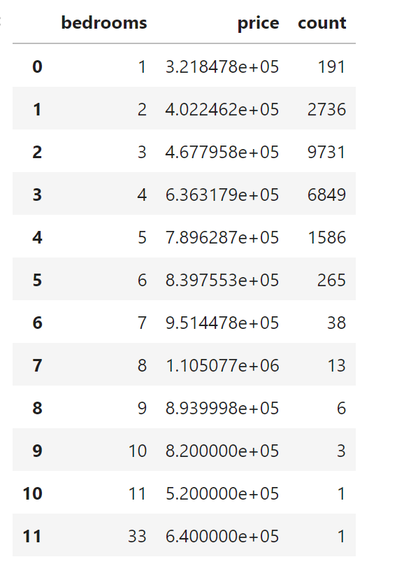
  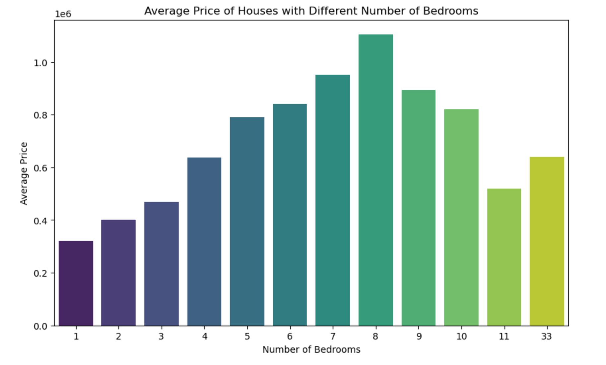

  **Insights from the Average Price by Number of Bedrooms:**

**1.Price Increase with Bedrooms:**

There is a general trend where the average price of houses increases with the number of bedrooms. This is expected as larger houses with more bedrooms typically offer more living space and amenities.
| Bedrooms | Price        |
|----------|--------------|
| 1        | $321,848     |
| 2        | $402,246     |
| 3        | $467,796     |
| 4        | $636,318     |
| 5        | $789,629     |
| 6        | $839,755     |

**2.Anomalies:**

There is a noticeable jump in average price for houses with 7 and 8 bedrooms compared to those with 5 or 6 bedrooms

| Bedrooms | Price        |
|----------|--------------|
| 7        | $951,448     |
| 8        | $1,105,077   |

There are very few houses with 9 or more bedrooms, which may affect the reliability of the average price for these categories:

| Bedrooms | Price         |
|----------|---------------|
| 9        | $893,999 (6 houses) |
| 10       | $820,000 (3 houses) |
| 11       | $520,000 (1 house)  |
| 33       | $640,000 (1 house)  |

**3.Market Segmentation:**

The bulk of houses are in the 2-4 bedroom range, representing a large segment of the market. They have moderate average prices and likely represent the middle-market segment, appealing to typical family units:

| Bedrooms | Number of Houses |
|----------|-------------------|
| 2        | 2,736 houses      |
| 3        | 9,731 houses      |
| 4        | 6,849 houses      |

Houses with 5 or more bedrooms tend to have a higher average price, indicating they are more likely to be premium or luxury properties catering to larger families or high-net-worth individuals.

**4.Diminishing Returns:**

The increase in average price between houses with 1 and 2 bedrooms is significant, but the incremental increase diminishes slightly as the number of bedrooms increases beyond 4. This suggests a potential saturation point where adding more bedrooms does not proportionately increase the house price.

Next, we can look at how the prices differ according to different square footages of living spaces.

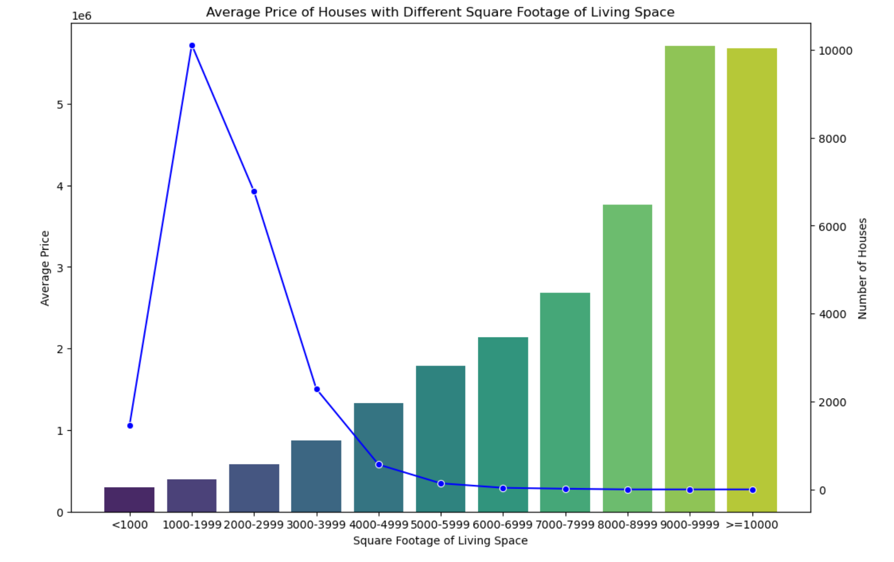

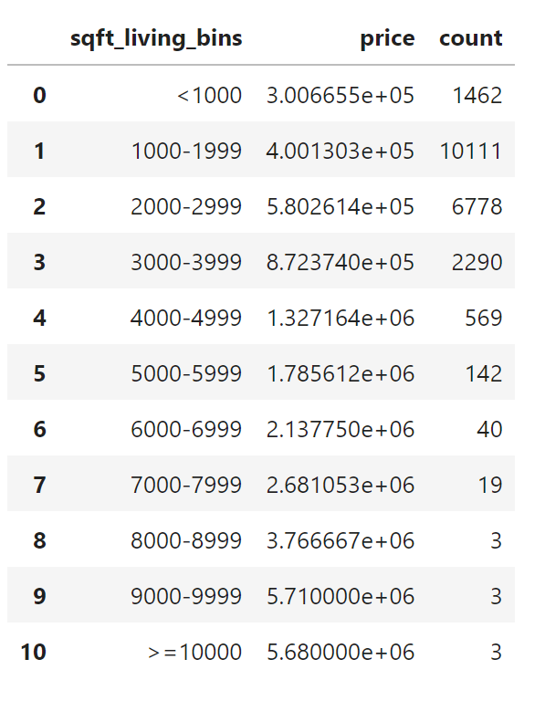

Insights from prices of homes according to the square footage of the living area of the homes:

   **(i)Mainstream Market:**

The majority of houses are in the 1000-1999 and 2000-2999 square feet range, indicating this is the mainstream market segment.

   **(ii)Premium Segment:**

Houses with 3000-3999 square feet start to enter the premium segment with significantly higher average prices.

  **(iii)Luxury Market:**

Houses with 4000+ square feet represent the luxury market, with average prices increasing sharply.

Now lets take a look at average prices of houses with and without a waterfront

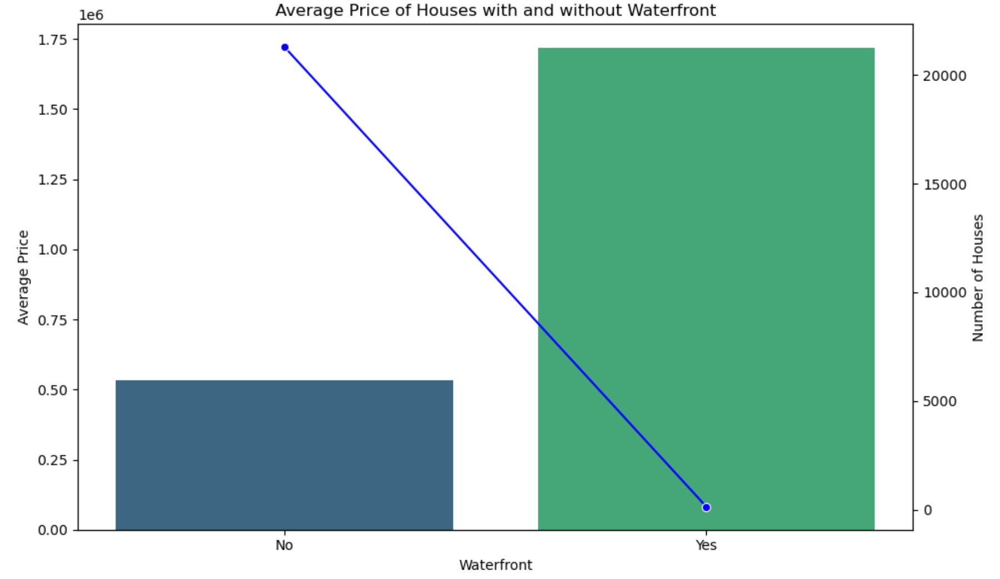

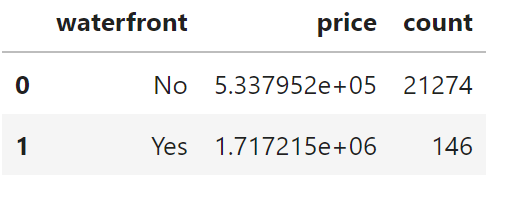

   **1.Average Price:**

Waterfront properties have a significantly higher average price compared to non-waterfront properties:

  * Waterfront: $1,674,470

  * Non-Waterfront: $534,170

**2.Property Count:**

The number of waterfront properties is much lower compared to non-waterfront properties:

  * Waterfront: 146 houses

  * Non-Waterfront: 21,274 houses

   **Key Insights:**

  * **Premium Value:** Waterfront properties command a much higher premium, reflecting their desirability and the limited supply.

  * **Market Segmentation:** The waterfront property segment is niche and significantly more valuable, making it a high-end market segment.

  * **coInvestment Strategy:** For investors and developers, focusing on waterfront properties can yield higher returns, though the market is smaller.

Now lets take a look at how the view influences prices of the homes

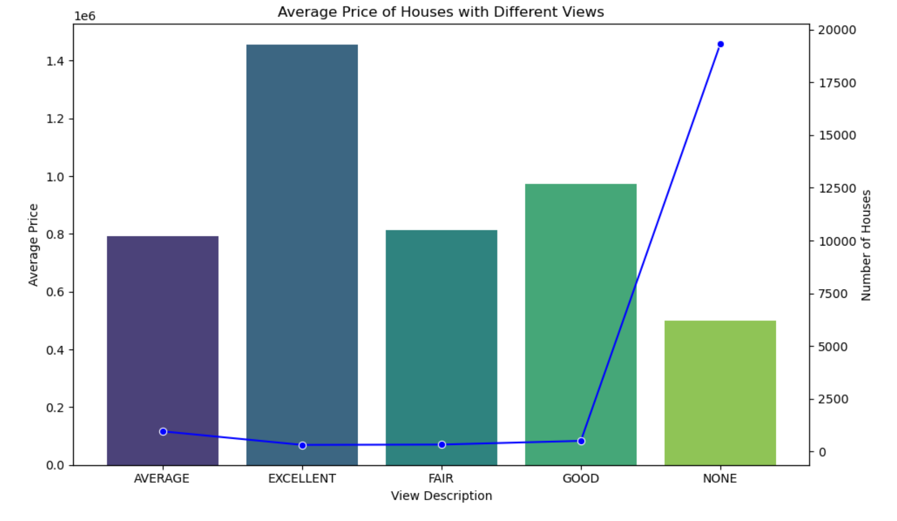
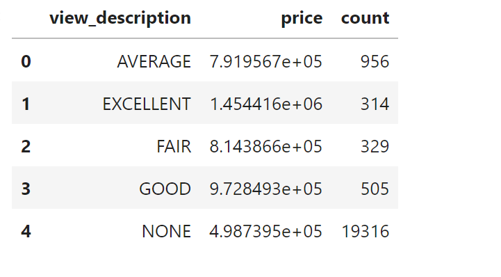

  **1.Average Price:**

There is a clear trend where the quality of the view correlates with the average house price:

  * None: $499,307

  * Fair: $647,991

  * Average: $728,486

  * Good: $908,239

  * Excellent: $1,363,011

  **2.Property Count:**

The majority of houses have no notable view, with decreasing counts as the view quality improves:

  * None: 19,682 houses

  * Fair: 963 houses

  * Average: 511 houses

  * Good: 513 houses

  * Excellent: 257 houses

  **Key Insights:**

* **Premium Value:** Houses with better views command significantly higher prices, with the highest average prices for houses with excellent views.

* **Market Segmentation:** The majority of houses fall into the 'None' category, indicating that premium views are less common and therefore more valuable.

*  **Investment Strategy:** Investing in properties with good or excellent views can yield higher returns, though such properties are rarer.

Now let's see the average price of every condition

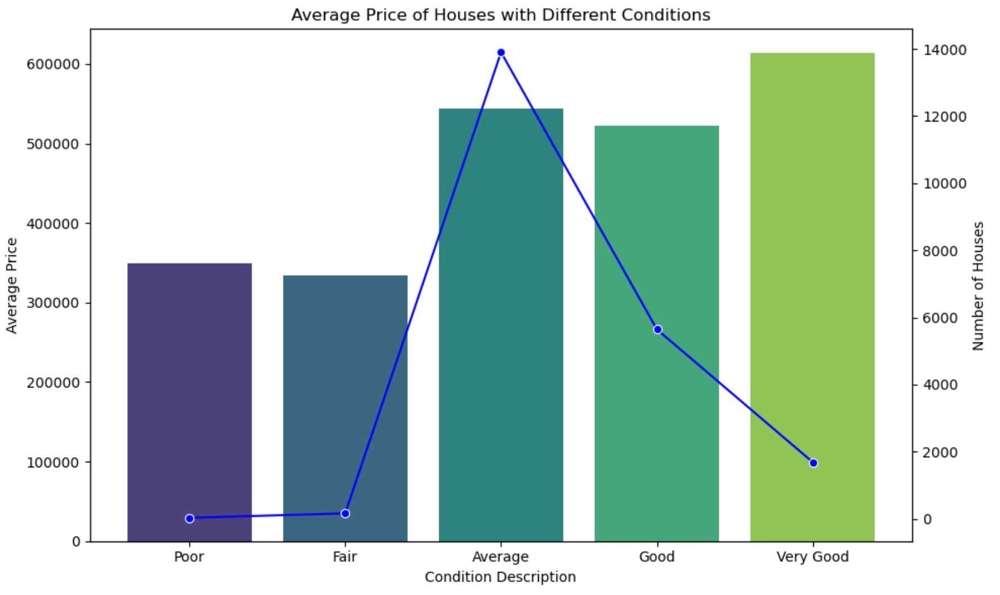
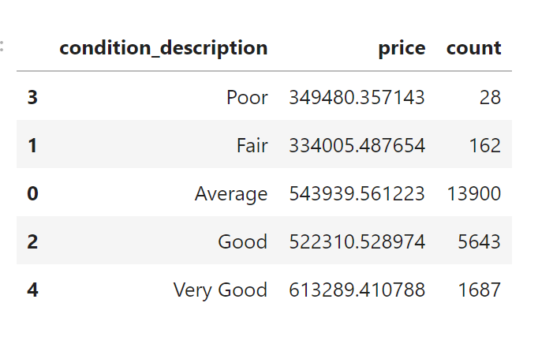

**1.Average Price:**

The average price increases with better house condition:

  * Poor: $270,654

  * Fair: $356,379

  * Average: $532,948

  * Good: $678,581

  * Very Good: $741,739

**2.Property Count:**

Most houses are in average or good condition:

  * Poor: 29 houses

  * Fair: 170 houses

  * Average: 14,020 houses

  * Good: 5,677 houses

  * Very Good: 1,701 houses

  **Key Insights:**

   *  **Premium Value:** There is a clear premium associated with houses in better condition. Investing in improving the condition of a property could significantly increase its market value.

  *  **Market Segmentation:** The majority of houses are in average or good condition, making up a significant part of the market.

  *  **Investment Strategy:** Properties in poor or fair condition present opportunities for renovation and value addition, given the substantial price increase associated with improving the condition.

  Now lets take a look at how the grade description relates with price

  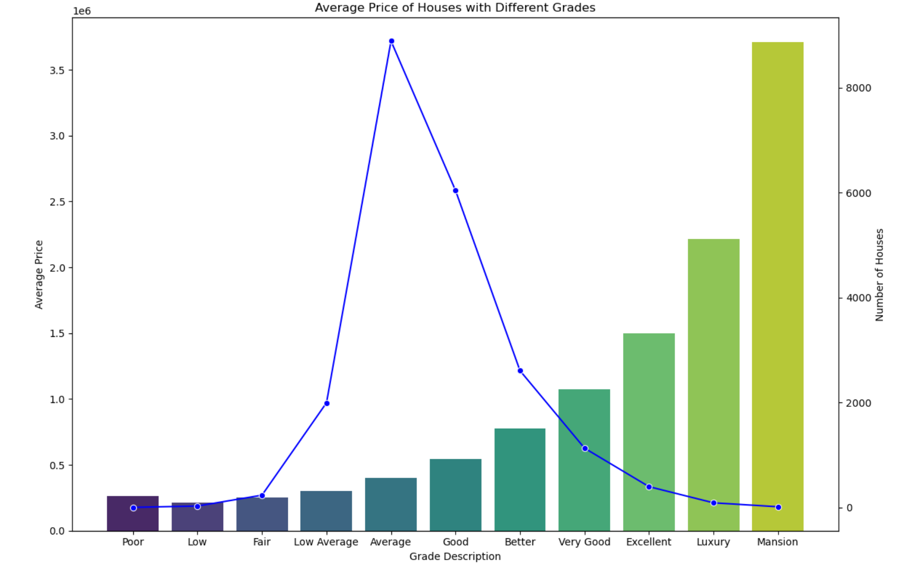 

  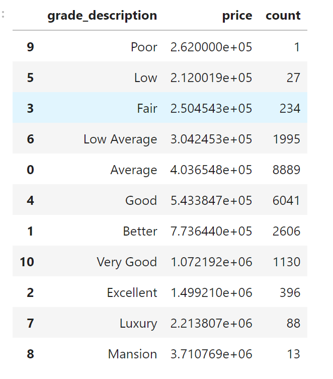

  **Key Insights:**

Premium Value: Houses with higher grades command significantly higher prices.

  *  **Market Segmentation:** The majority of houses are in the 'Average' and 'Good' categories, representing a large segment of the market. Higher grades are less common but command higher prices.

  *  **Investment Strategy:** Investing in upgrading the grade of a property could yield substantial returns due to the significant price increase associated with higher grades.

Now lets take a closer look at the yr_built vs price

We will group the houses into decades to avoid too many unique values.

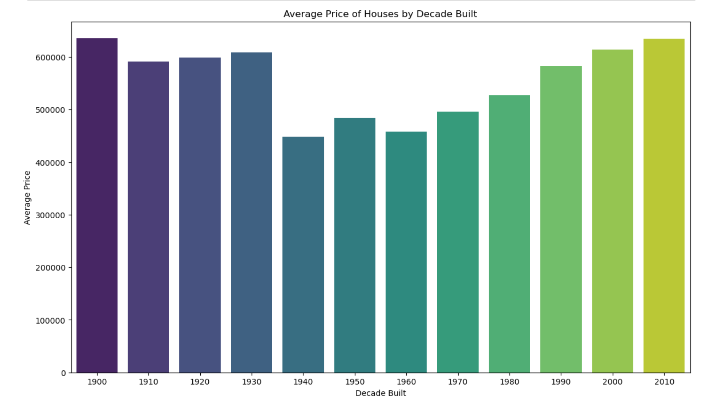

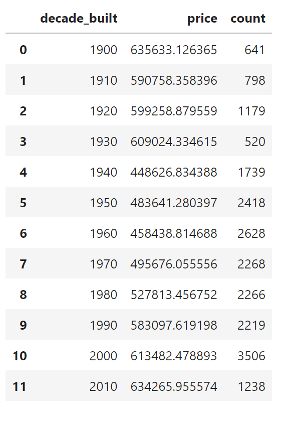

**Key Insights:**

  **1.Historical Value:**

Houses built in the early 20th century (1900-1930) have relatively high average prices.

This might be due to their historical value, architectural styles, or location.

  **2.Mid-20th Century:**

Houses built between 1940 and 1960 show a dip in average prices.

  **3.Modern Era:**

Starting from the 1970s, there is a gradual increase in average prices.

This trend continues into the 2000s and 2010s, reflecting modern construction techniques, better amenities, and potentially higher demand for newer houses.

  **4.Recent Construction:**

The most recent decade (2010s) shows the highest average prices, indicating that newer constructions are more expensive, possibly due to higher construction costs, better facilities, and modern designs.

Now let's calculate the average price for each zip code

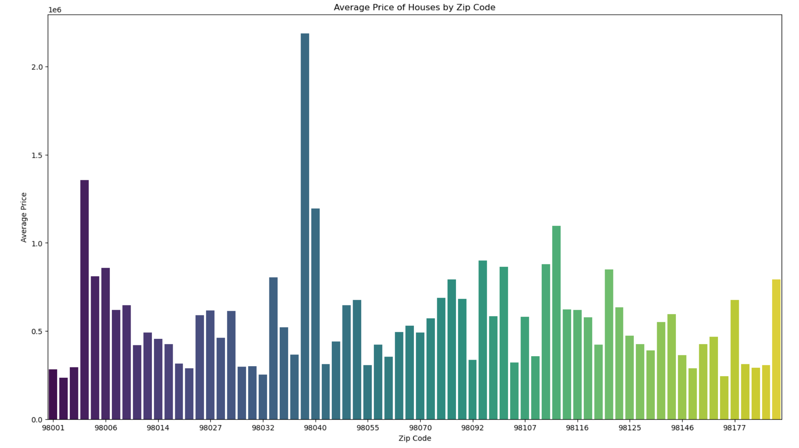

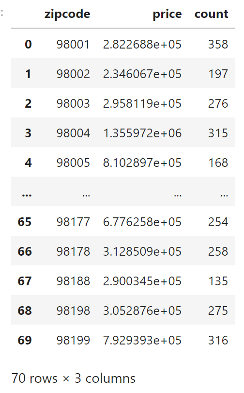

From this, lets try and find out zip codes that have low counts of houses (defined by lower than the first quartile) and high house prices (defined by higher than the third quartile)

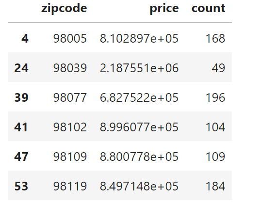

From Google Search, we could find out the areas in King County that are represented by these zip codes.

   * 98005: This zip code covers parts of Bellevue, WA.

   * 98039: This zip code is associated with Medina, WA.

   * 98077: This zip code covers parts of Woodinville, WA.

   * 98102: This zip code includes parts of Capitol Hill and Eastlake in Seattle, WA.

   * 98109: This zip code covers South Lake Union and parts of Queen Anne in Seattle, WA.

   * 98119: This zip code includes parts of Queen Anne, specifically the northern part, in Seattle, WA.

These areas are characterized by their high property values, desirable locations, and quality of life, making them some of the most sought-after neighborhoods in King County. This could explain the high pricing of houses.

**Calculating the correlation matrix**

**1.Price:**

  * Highly correlated with sqft_living (0.701917), grade_numeric (0.667951), and total_square_footage (0.668185).

  * Moderately correlated with bathrooms (0.519628), sqft_above (0.605368), and sqft_living15 (0.585241).

**2.Bedrooms:**

  * Moderately correlated with sqft_living (0.578212), total_square_footage (0.562662), and sqft_above (0.479386).

**3.Bathrooms:**

  * Highly correlated with sqft_living (0.702719) and total_square_footage (0.671770).

**4.Sqft Living:**

  * Very highly correlated with total_square_footage (0.941166).

  * Highly correlated with sqft_above (0.876448) and bathrooms (0.702719).

**5.Floors:**

   * Shows some correlation with price (0.244832) and bathrooms (0.327893).

**6.Waterfront:**

  * Moderately correlated with price (0.264306) and view (0.393497).

**7.View:**

  * Moderately correlated with price (0.393497) and sqft_living (0.281715).

**8.Condition:**

  * Shows low correlation with most features.

**9.Sqft Above:**

  * Very highly correlated with sqft_living (0.876448).

**10.Sqft Basement:**

  * Moderately correlated with price (0.321108) and total_square_footage (0.708763).

**11.Yr Built:**

  * Shows low correlation with most features.

**12.Yr Renovated:**

  * Shows some correlation with price (0.117855).

**13.Sqft Living15:**

  * Highly correlated with sqft_living (0.756402) and total_square_footage (0.665161).

**14.Sqft Lot15:**

  * Highly correlated with sqft_lot (0.718204).

**15.Grade Numeric:**

  * Highly correlated with price (0.667951) and sqft_living (0.762779).

**16.Age of House:**

  * Negatively correlated with price (-0.053953) and grade_numeric (-0.199762).

**17Renovation Age:**

  * Shows low correlation with most features.

       **Visualizing The Correlation Matrix**

  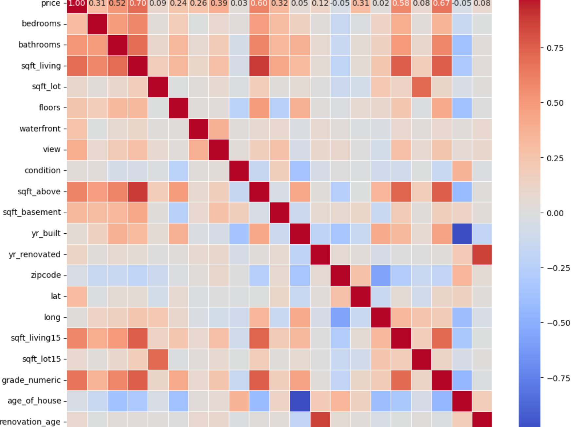

  Since price is our target variable, lets see how our variables relate with price.

  **Calculating correlation of columns with price**

  Extract correlations with price and sort them in descending order

| Column           | Correlation |
|------------------|-------------|
| price            | 1.000000    |
| sqft_living      | 0.701295    |
| grade_numeric    | 0.666835    |
| sqft_above       | 0.604424    |
| sqft_living15    | 0.583792    |
| bathrooms        | 0.519198    |
| view             | 0.392787    |
| sqft_basement    | 0.321264    |
| bedrooms         | 0.309640    |
| lat              | 0.306439    |
| waterfront       | 0.264915    |
| floors           | 0.243406    |
| yr_renovated     | 0.118278    |
| sqft_lot         | 0.088789    |
| renovation_age   | 0.083563    |
| sqft_lot15       | 0.082045    |
| yr_built         | 0.051012    |
| condition        | 0.034219    |
| long             | 0.019826    |
| age_of_house     | -0.051012   |
| zipcode          | -0.051169   |

 Select only positive correlations

 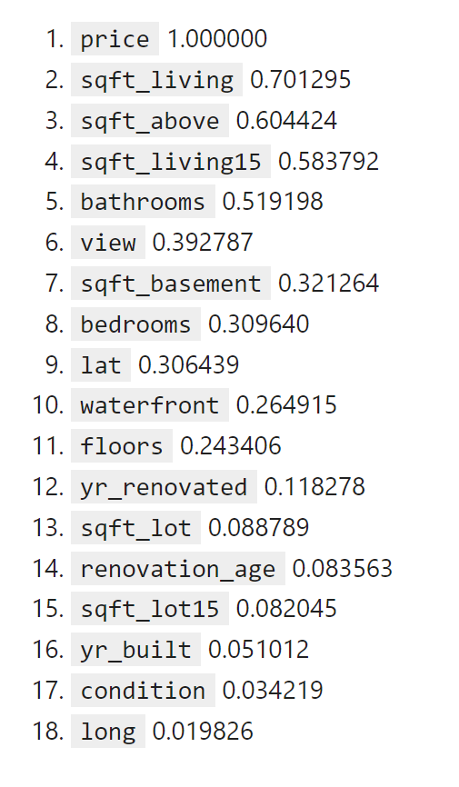

 select only negative correlations

 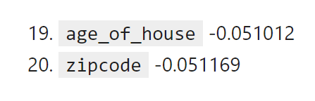

 **##Visualizing the correlations with price**

 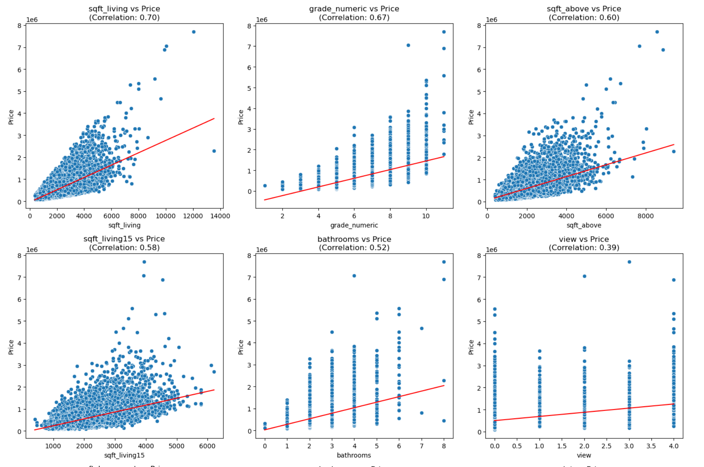
 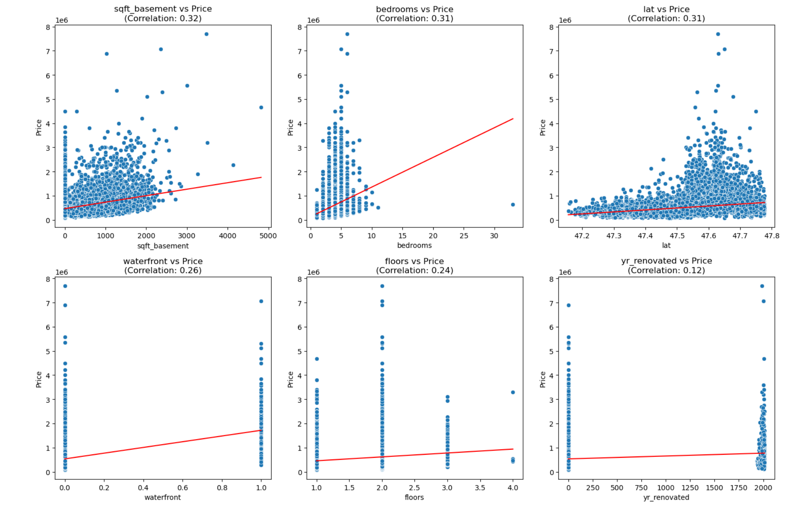
 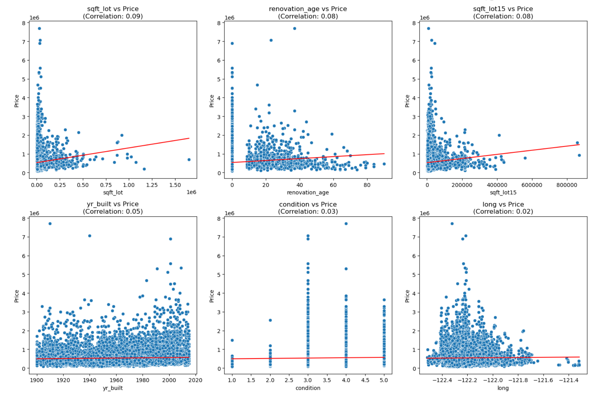
 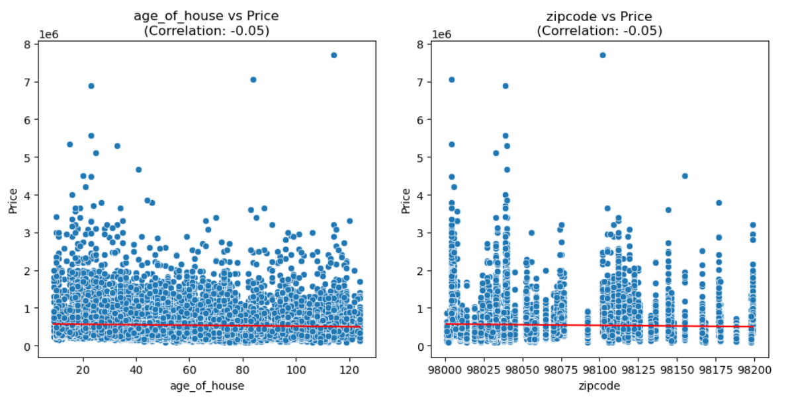

   **Checking for outliers**

We will identify  outliers using the IQR method

| Column          | Number of Outliers |
|-----------------|---------------------|
| price           | 1152                |
| bedrooms        | 518                 |
| bathrooms       | 7675                |
| sqft_living     | 568                 |
| sqft_lot        | 2406                |
| floors          | 7                   |
| waterfront      | 146                 |
| view            | 2104                |
| condition       | 28                  |
| sqft_above      | 600                 |
| sqft_basement   | 556                 |
| yr_built        | 0                   |
| yr_renovated    | 740                 |
| zipcode         | 0                   |
| lat             | 2                   |
| long            | 252                 |
| sqft_living15   | 503                 |
| sqft_lot15      | 2174                |
| grade_numeric   | 1889                |
| age_of_house    | 0                   |
| renovation_age  | 740                 |
| decade_built    | 0                   |

We will then visualizing the outliers using box plots

   **Simple Liner Regression Model**